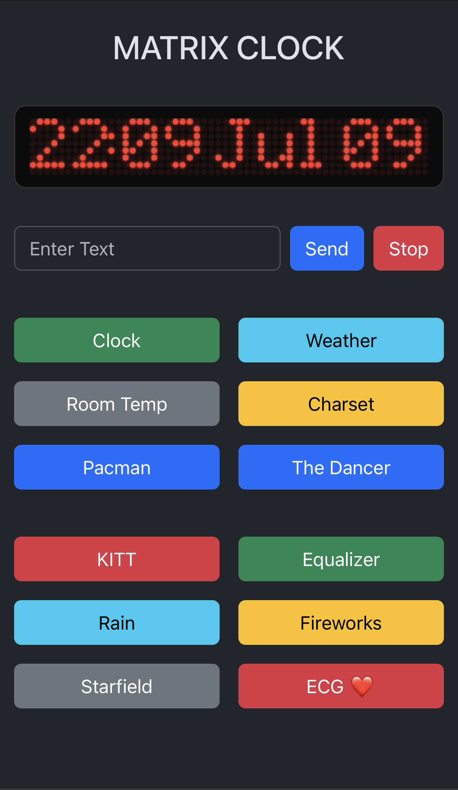

# Matrix Display

A web-controlled LED matrix display — clock, weather station and animation toy, running on a
Raspberry Pi Zero 2 W driving seven cascaded 8×8 MAX7219 modules (56×8 pixels).



A small Flask app owns the display and swaps "workers" (clock, weather, text,
animations) on a single background thread — one process, no fighting over SPI.
The web page also shows a **live replica** of the physical panel, rendered on a
`<canvas>` from the real framebuffer.

## Features

- **Clock** (default) — `HH:MM` with blinking colon and date, slide animation on
  minute change, auto-dims at night (21:00–06:00)
- **Weather** — current temperature, condition and humidity from
  [Open-Meteo](https://open-meteo.com/) (no API key), location pinned via env vars
- **Room Temp** — live temperature/humidity from a DHT11 sensor on GPIO4
- **Custom text** — type a message, it scrolls until you press Stop
- **Animations** — Pacman chase (with pellets and a ghost, random direction),
  The Dancer (three bouncing stick figures), KITT scanner, Equalizer, Matrix rain,
  Fireworks (with brightness fade), Starfield (with a ship), ECG heartbeat,
  and a CP437 charset demo
- **Live web replica** — the page mirrors the physical panel in real time
- **Responsive UI** — Bootstrap 5, works on phones

## Hardware

| Part | Notes |
|---|---|
| Raspberry Pi Zero 2 W | any Pi with SPI works |
| MAX7219 8×8 LED matrix ×7 (cascaded) | 56×8 pixels total |
| DHT11 sensor | data pin on **GPIO4** (optional — Room Temp button) |

### Wiring (MAX7219)

| MAX7219 | Pi pin |
|---|---|
| VCC | 5V |
| GND | GND |
| DIN | GPIO10 (MOSI) |
| CS  | GPIO8 (CE0) |
| CLK | GPIO11 (SCLK) |

## Install

```bash
# enable SPI
sudo raspi-config nonint do_spi 0

git clone https://github.com/<you>/matrix-display.git
cd matrix-display
python3 -m venv venv
venv/bin/pip install flask luma.led_matrix adafruit-circuitpython-dht
```

Tested with Python 3.13, Flask 3.1, luma.led_matrix 1.9, adafruit-circuitpython-dht 4.0.

## Run

```bash
venv/bin/python3 app.py
```

Then open `http://<pi-ip>:5000`.

### As a systemd service

`/etc/systemd/system/matrix-display.service`:

```ini
[Unit]
Description=Matrix Display
After=network-online.target

[Service]
WorkingDirectory=/home/pi/matrix-display
Environment=PATH=/home/pi/matrix-display/venv/bin
Environment=LED_CITY=Dehradun
Environment=LED_LAT=30.3165
Environment=LED_LON=78.0322
ExecStart=/home/pi/matrix-display/venv/bin/python3 app.py
Restart=on-failure

[Install]
WantedBy=multi-user.target
```

```bash
sudo systemctl enable --now matrix-display.service
```

## Configuration

All optional, via environment variables:

| Variable | Default | Purpose |
|---|---|---|
| `LED_CITY` / `LED_LAT` / `LED_LON` | IP geolocation | pin the weather location (recommended — IP geolocation drifts) |
| `LED_HOST` | `0.0.0.0` | bind address |
| `LED_PORT` | `5000` | port |
| `LED_DEBUG` | off | set `1` for the Flask debugger (never on an exposed host) |

If your panel differs, adjust `cascaded=7` / `block_orientation=-90` in
`init_device()` in `app.py`.

## HTTP API

Every button is a plain POST route, so you can drive the panel with `curl`:

| Route | Action |
|---|---|
| `POST /startclock` | show the clock |
| `POST /weather` | scroll current weather |
| `POST /dht` | scroll DHT11 room temp/humidity |
| `POST /ledtext` (`ledtext=<msg>`) | scroll a custom message |
| `POST /stopledtext` | stop current mode, back to clock |
| `POST /charset` | CP437 font demo |
| `POST /pacman` `/dancer` `/kitt` `/equalizer` `/rain` `/fireworks` `/starfield` `/ecg` | animations |
| `GET /frame` | current framebuffer as `W H <bits>` (drives the web replica) |
| `GET /health` | liveness check |

## How the live replica works

`framebuf.py` wraps the luma device's `display()` so every flush to the physical
panel also writes the 56×8 frame to `/dev/shm/led_frame` (atomic replace). The
page polls `GET /frame` a few times a second and draws the bits as glowing dots
on a canvas — what you see in the browser is exactly what the LEDs show.

## Project structure

```
app.py               Flask app: device setup, workers (clock/weather/animations), routes
framebuf.py          framebuffer publisher for the web replica
templates/
  index.html         web UI (Bootstrap 5 + canvas replica)
matrix.png           the real thing
```

## Credits

- [luma.led_matrix](https://github.com/rm-hull/luma.led_matrix) — MAX7219 driver;
  the clock face and charset demo started from its examples
- [Open-Meteo](https://open-meteo.com/) — free weather API
- [ip-api.com](http://ip-api.com/) — IP geolocation fallback
